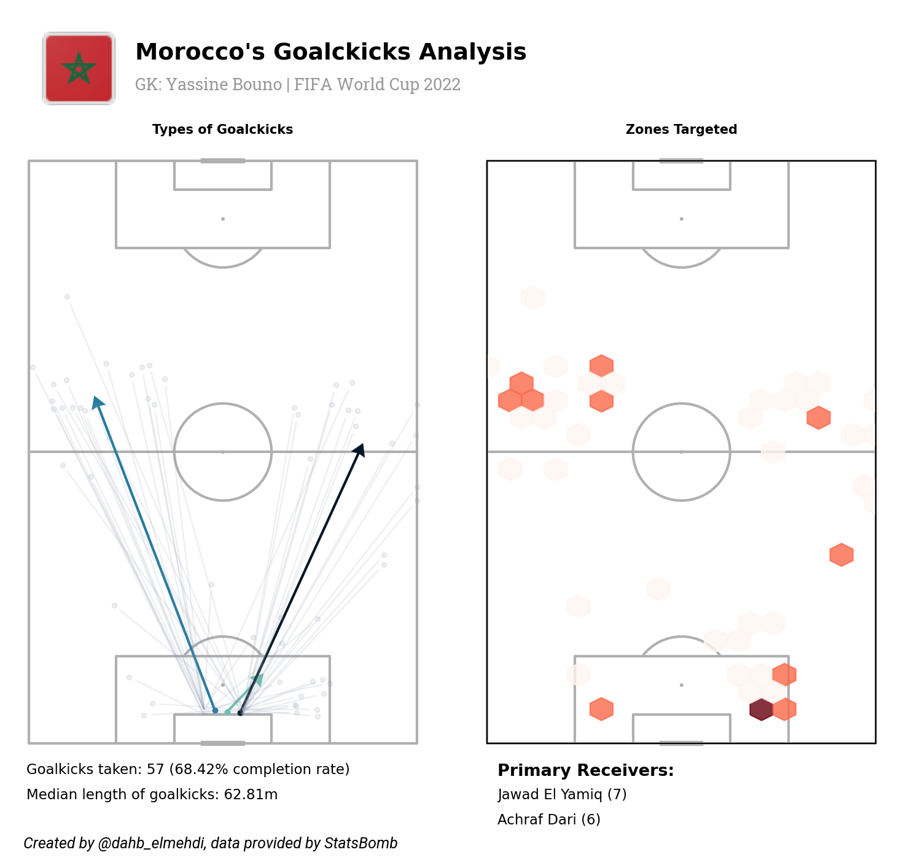
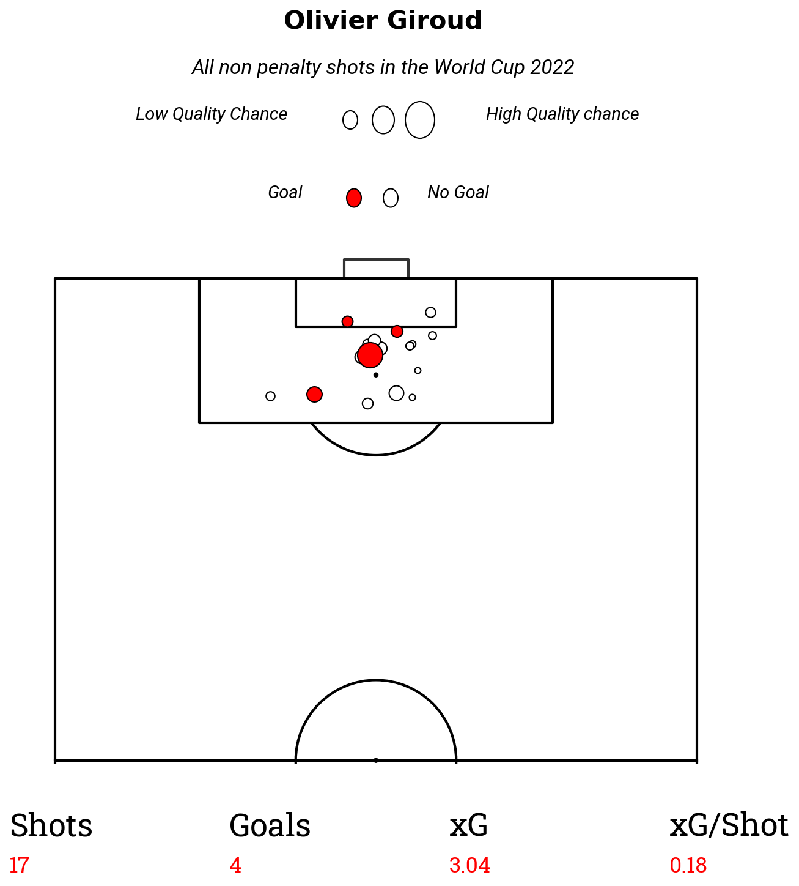

# World Cup Data Visualization

* Used different statistical approaches and other data processing and data visualization techniques to analyze player or teams performances through various sorts of events; passes, carries, shoots, defensive actions, and so on, using statsbomb free event data, specifically World Cup 2022 event data.
* Preprocessed and extracted aggregated data (metrics) of player's performance throughout the whoel comptition and profiled these players.

## Plots
#### [Carries](https://github.com/youssefHosni/Data-Science-Portofolio/tree/main/Machine%20Learning/Classification/Sensor-activity-recognition)

* Ball carrying distribution by player.
* A player's carries that ended in the opponent's half.
* Calculated the truer progressing carrier and plotted all of their carries.
---
#### [Passes](https://github.com/youssefHosni/Data-Science-Portofolio/tree/main/Machine%20Learning/Classification/Sensor-activity-recognition)

* Demonstrated a player's two-footedness by plotting his right and left foot passes.
* Passing Networks.
* Hetmaps displaying where forwards from national African teams received the ball.
* Goalkicks Analysis:  

---

#### [Player performances](https://github.com/youssefHosni/Data-Science-Portofolio/tree/main/Machine%20Learning/Classification/Sensor-activity-recognition)

* Passes pitch plot: included passes, progressive passes, key passes, assists, and passing completion rate. 
* Carries pitch plot: included carries, progressive carries, attempted dribbles, and succesful dribbles.
* Defensive actions pitch plot: includes attempted and won tackles, interceptions, ball reoveries, and aerials (attempted & won).
* Putting all this plots together we get to visualize a player performances through different aspects of the game:

---

#### [Player profile](https://github.com/youssefHosni/Data-Science-Portofolio/tree/main/Machine%20Learning/Classification/Sensor-activity-recognition)

* I extracted aggregated data and analyzed a midfielder using a set of on-ball metrics:

---

#### [Shots](https://github.com/youssefHosni/Data-Science-Portofolio/tree/main/Machine%20Learning/Classification/Sensor-activity-recognition)

* Shots taken by players, supported with number of shots, goals, xG (expected goals) and xG per shot
* Shots taken during a match

